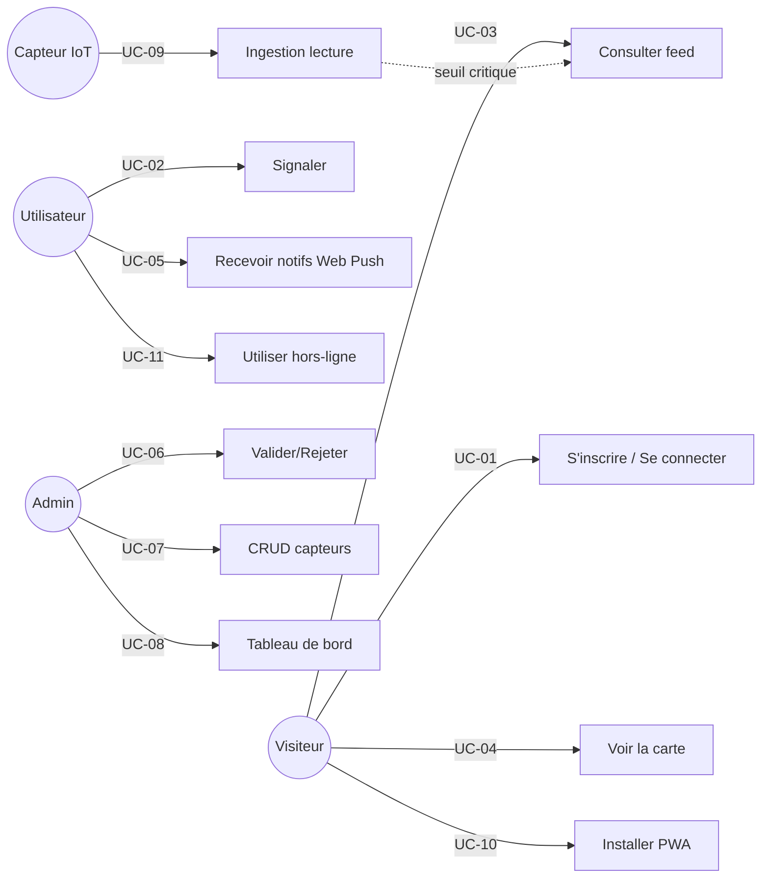

# Cahier des charges — **Alerte Douala**

> Plateforme citoyenne web (PWA) + réseau de capteurs IoT pour le signalement, la validation et la diffusion des catastrophes naturelles à Douala (Cameroun).

| Champ | Valeur |
|---|---|
| **Nom du projet** | Alerte Douala |
| **Version du document** | 1.0 |
| **Date** | Mai 2026 |
| **Statut** | Document de référence — soutenance académique |
| **Audience** | Encadrant·e académique / jury de soutenance |
| **Auteur·e** | Étudiant·e porteur·euse du projet |
| **Code source** | Dépôt Git du projet (`backend/`, `src/`, `firmware/`) |

---

## Table des matières

1. [Préambule et glossaire](#1-préambule-et-glossaire)
2. [Présentation du projet](#2-présentation-du-projet)
3. [Étude de l'existant](#3-étude-de-lexistant)
4. [Besoins fonctionnels](#4-besoins-fonctionnels)
5. [Spécifications techniques](#5-spécifications-techniques)
6. [Exigences non-fonctionnelles](#6-exigences-non-fonctionnelles)
7. [Planning prévisionnel](#7-planning-prévisionnel)
8. [Budget estimatif](#8-budget-estimatif)
9. [Stratégie de tests et critères d'acceptation](#9-stratégie-de-tests-et-critères-dacceptation)
10. [Analyse de risques et mitigation](#10-analyse-de-risques-et-mitigation)
11. [Livrables finaux](#11-livrables-finaux)
12. [Annexes](#12-annexes)

---

## 1. Préambule et glossaire

### 1.1 Objet du document

Le présent cahier des charges décrit de manière **précise et explicite** l'ensemble des besoins, contraintes, fonctionnalités, spécifications techniques, ressources et critères de réussite du projet *Alerte Douala*. Il sert de **document contractuel et pédagogique** entre l'étudiant·e porteur·euse, son encadrant·e et le jury de soutenance.

Toute fonctionnalité ou contrainte non mentionnée dans ce document est considérée comme **hors périmètre** de la version 1.0 du projet.

### 1.2 Glossaire métier

| Terme | Définition |
|---|---|
| **Signalement / Disaster** | Déclaration d'un événement (inondation, glissement, incendie, tempête, autre) par un·e citoyen·ne ou un capteur IoT. |
| **Validation** | Acte par lequel un administrateur confirme qu'un signalement est réel et publiable. |
| **Rejet** | Acte par lequel un administrateur écarte un signalement (faux, doublon, hors périmètre). |
| **Quartier / Zone** | Subdivision géographique de Douala parmi les 12 retenues (Akwa, Bonanjo, Deïdo, Bonabéri, New Bell, Ndogpassi, Logbessou, PK Axe Lourd, Makepè, Bonamoussadi, Bépanda, Village). |
| **Sévérité** | Niveau de gravité d'un signalement : `low`, `medium`, `high`, `critical`. |
| **Capteur / Sensor** | Dispositif ESP32 installé sur le terrain, qui transmet en continu des mesures (eau, pluie, sol). |
| **Lecture / Reading** | Une mesure horodatée envoyée par un capteur. |
| **Alerte auto-générée** | Disaster créé automatiquement par le backend quand un capteur dépasse un seuil critique. |
| **Cooldown** | Délai minimum entre deux alertes auto pour un même capteur (30 min). |

### 1.3 Glossaire technique

| Acronyme | Signification |
|---|---|
| **PWA** | Progressive Web App — application web installable, offline-capable. |
| **JWT** | JSON Web Token — jeton d'authentification signé. |
| **SSE** | Server-Sent Events — flux HTTP unidirectionnel serveur → client. |
| **VAPID** | Voluntary Application Server Identification — clés cryptographiques pour Web Push. |
| **REST** | Representational State Transfer — architecture d'API HTTP. |
| **CORS** | Cross-Origin Resource Sharing — politique d'accès navigateur. |
| **HMR** | Hot Module Replacement — rechargement à chaud Vite. |
| **MCU** | Microcontroller Unit — microcontrôleur (ici ESP32). |
| **GPIO** | General Purpose Input/Output — broche d'entrée/sortie. |
| **ADC** | Analog-to-Digital Converter — convertisseur analogique-numérique. |
| **OSM** | OpenStreetMap — fond cartographique libre. |
| **Bcrypt** | Algorithme de hachage de mots de passe. |
| **CRUD** | Create, Read, Update, Delete. |
| **OWASP** | Open Web Application Security Project — référentiel sécurité. |

---

## 2. Présentation du projet

### 2.1 Contexte général

Douala, capitale économique du Cameroun (≈ 3,7 millions d'habitants), est exposée à plusieurs risques naturels récurrents :

- **Inondations** : durant la saison des pluies (mai → octobre), les bassins versants du Wouri saturent, les drains coloniaux sous-dimensionnés débordent, et plusieurs quartiers (Bépanda, New Bell, Bonabéri, Ndogpassi) sont régulièrement submergés.
- **Glissements de terrain** : les coteaux urbanisés sans étude géotechnique (Logbessou, PK Axe Lourd) cèdent après de fortes précipitations.
- **Incendies urbains** : densité d'habitat, installations électriques précaires, marchés à risque (Sandaga, Mboppi).
- **Tempêtes côtières** : vents violents, dégâts sur l'habitat léger.

Les services municipaux et de protection civile manquent d'**outil temps réel** pour collecter, qualifier et diffuser ces alertes. Les citoyen·ne·s, malgré des smartphones largement diffusés, n'ont pas de canal unique pour signaler et s'informer.

### 2.2 Problématique

> **Comment outiller à la fois les citoyen·ne·s, l'administration locale et le terrain (capteurs) pour détecter, valider et diffuser en temps réel les catastrophes naturelles à Douala, malgré les contraintes de connectivité, d'électricité et de littératie numérique ?**

Trois sous-problèmes :

1. **Collecte fragmentée** : aujourd'hui les signalements circulent via WhatsApp, Facebook, radios — dispersés, non vérifiés, non géolocalisés.
2. **Absence de mesure objective** : les autorités réagissent *après* le pic, faute de capteurs hydrométéorologiques accessibles.
3. **Pas de diffusion coordonnée** : aucune notification temps réel ciblée par zone n'existe à destination du public.

### 2.3 Objectifs

#### Objectif général

Concevoir et déployer une **plateforme web installable (PWA) + un réseau de capteurs IoT bas coût** permettant à toute personne disposant d'un smartphone de **signaler**, **consulter** et **être notifiée** des catastrophes naturelles à Douala, avec une **validation administrative** et une **détection automatique** sur seuils capteur.

#### Objectifs spécifiques

| Code | Objectif spécifique | Indicateur de réussite |
|---|---|---|
| OS-1 | Permettre à tout·e citoyen·ne authentifié·e de signaler une catastrophe en moins de 90 secondes, photo comprise. | Temps moyen mesuré sur 20 sessions pilote ≤ 90 s. |
| OS-2 | Faire valider/rejeter chaque signalement par un·e admin en moins de 24 h. | 90 % des signalements traités en < 24 h. |
| OS-3 | Déployer 6 capteurs ESP32 dans 6 quartiers représentatifs (Akwa, Bonabéri, New Bell, Bépanda, Ndogpassi, Makepè). | 6 capteurs opérationnels 90 % du temps. |
| OS-4 | Détecter et diffuser automatiquement une alerte capteur en moins de 2 secondes après réception d'une lecture critique. | Latence p95 ≤ 2 s mesurée en intégration. |
| OS-5 | Cartographier les zones à risque agrégées (capteurs + signalements) sur une carte Leaflet interactive. | Carte fonctionnelle avec ≥ 3 niveaux de risque visibles. |

### 2.4 Public cible

| Acteur | Profil | Besoin principal |
|---|---|---|
| **Citoyen·ne lambda** | Habitant·e de Douala, smartphone Android/iPhone, connexion 3G/4G intermittente. | Signaler facilement, recevoir des alertes pertinentes pour sa zone. |
| **Administrateur·ice municipal** | Agent de la mairie ou de la protection civile, ordinateur de bureau. | Modérer rapidement les signalements, consulter les statistiques, gérer les capteurs. |
| **Services de secours** | Sapeurs-pompiers, croix-rouge. | Vision agrégée temps réel, export possible pour intervention. |
| **Chercheur·euse / ONG** | Universitaire, ONG climat. | Accès aux données publiques (feed, stats), réutilisation pour études. |

### 2.5 Périmètre fonctionnel et géographique

**Géographique** : 12 quartiers de Douala couverts en V1, listés ci-dessous avec leurs coordonnées GPS (extrait de [backend/src/constants/domain.js](../backend/src/constants/domain.js)) :

| ID | Quartier | Arrondissement | Latitude | Longitude |
|---|---|---|---|---|
| `akwa` | Akwa | Douala 1er | 4.0469 | 9.7034 |
| `bonanjo` | Bonanjo | Douala 1er | 4.0466 | 9.6921 |
| `deido` | Deïdo | Douala 1er | 4.0625 | 9.7055 |
| `bonaberi` | Bonabéri | Douala 4e | 4.0822 | 9.6622 |
| `new-bell` | New Bell | Douala 2e | 4.0426 | 9.7244 |
| `ndogpassi` | Ndogpassi | Douala 3e | 4.075 | 9.78 |
| `logbessou` | Logbessou | Douala 5e | 4.083 | 9.79 |
| `pk` | PK Axe Lourd | Douala 3e | 4.099 | 9.81 |
| `makepe` | Makepè | Douala 5e | 4.0717 | 9.7531 |
| `bonamoussadi` | Bonamoussadi | Douala 5e | 4.085 | 9.755 |
| `bepanda` | Bépanda | Douala 5e | 4.07 | 9.74 |
| `village` | Village | Douala 1er | 4.06 | 9.69 |

**Fonctionnel V1** :
- Inscription / connexion (rôles user, admin)
- Signalement avec photo, géolocalisation par zone, type, sévérité
- Validation/Rejet par admin
- Carte interactive zones de risque + capteurs
- Notifications temps réel (SSE + Web Push)
- Tableau de bord utilisateur et admin
- Ingestion automatique des capteurs ESP32
- PWA installable, fonctionnement hors-ligne (cache app shell + dernières alertes)

**Hors périmètre V1** :
- Application native iOS/Android (la PWA suffit)
- SMS d'alerte (coût opérateur prohibitif pour la V1)
- Multi-villes (Yaoundé, Limbé… à l'étude phase 2)
- Paiements ou monétisation
- Modules d'apprentissage / éducation aux risques

---

## 3. Étude de l'existant

### 3.1 Solutions concurrentes ou voisines

| Solution | Forces | Faiblesses pour notre besoin |
|---|---|---|
| **Ushahidi** (plateforme open-source de crowdmapping crises) | Mature, multilingue, déjà utilisée en Afrique de l'Est. | Lourd à installer, pas d'intégration capteurs IoT native, UI vieillissante, pas pensé PWA. |
| **Google FloodHub** | Modèles ML très précis sur bassins versants équipés. | Couverture limitée, pas de Douala, pas de signalement citoyen, pas adapté à un projet étudiant. |
| **WhatsApp / groupes Facebook locaux** | Adoption massive. | Pas de modération, pas d'agrégation, pas géolocalisé, volatile. |
| **Téléphone vert mairie / pompiers** | Officiel. | Saturé pendant les crises, pas de trace, pas de visualisation. |

### 3.2 Positionnement différenciant d'*Alerte Douala*

1. **PWA installable** : pas de magasin d'apps, mise à jour automatique, légère (< 500 ko transférés à la première visite).
2. **Hybride humain + capteurs** : un signalement citoyen est validé manuellement ; un signalement capteur est validé automatiquement sur seuil critique → équilibre fiabilité/réactivité.
3. **Identité graphique locale** : « brutalisme éditorial tropical » (typographie Fraunces + Inter + JetBrains Mono, palette papier crème, vert mangrove, terre cuite, rouge alerte), affirmant l'ancrage camerounais.
4. **Open-source et reproductible** : tout le code (frontend, backend, firmware ESP32) est ouvert, documenté et calibrable sur site par un·e technicien·ne local·e.
5. **Bas coût** : matériel < 50 € par capteur (voir section 8).

---

## 4. Besoins fonctionnels

### 4.1 Acteurs et rôles

```
┌──────────────────────────────────────────────────────────────┐
│                      Alerte Douala — Acteurs                 │
├──────────────────────────────────────────────────────────────┤
│                                                              │
│  Visiteur          Utilisateur        Administrateur         │
│  anonyme           authentifié        (role=admin)           │
│   │                  │                  │                    │
│   ├─ consulter feed  ├─ signaler        ├─ valider/rejeter   │
│   ├─ voir carte      ├─ voir mes        ├─ CRUD capteurs     │
│   ├─ voir ticker     │   signalements   ├─ CRUD utilisateurs │
│   └─ s'inscrire      ├─ recevoir push   ├─ consulter stats   │
│                      └─ gérer profil    └─ logs activité     │
│                                                              │
│  Capteur IoT (acteur système)                                │
│   └─ POST /api/sensors/:deviceId/readings (x-api-key)        │
│                                                              │
└──────────────────────────────────────────────────────────────┘
```

| Acteur | Authentification | Permissions principales |
|---|---|---|
| **Visiteur anonyme** | Aucune | Lecture du feed public, ticker, stats publiques, sensors publics, inscription. |
| **Utilisateur (`role=user`)** | JWT Bearer | Toutes les actions visiteur + créer un signalement, voir ses propres signalements, recevoir des notifications, gérer son profil. |
| **Administrateur (`role=admin`)** | JWT Bearer | Toutes les actions user + valider/rejeter tous les signalements, CRUD capteurs, CRUD utilisateurs, consulter stats globales, logs d'activité. |
| **Capteur IoT** | Header `x-api-key` | Envoyer des lectures pour son `deviceId`. Aucun autre droit. |

### 4.2 Cas d'usage détaillés

Pour chaque cas d'usage : code, acteur, préconditions, scénario nominal, scénarios alternatifs, postconditions.

---

#### UC-01 — S'inscrire et se connecter

- **Acteur** : visiteur anonyme.
- **Préconditions** : néant.
- **Scénario nominal — Inscription** :
  1. Le visiteur ouvre `/inscription`.
  2. Il saisit email, mot de passe (≥ 8 caractères), nom d'affichage.
  3. Le backend vérifie l'unicité de l'email, hashe le mot de passe avec bcrypt (10 rounds), crée le user (role par défaut = `user`).
  4. Le backend renvoie `{user, token}` (JWT signé HS256, expiration 7 j).
  5. Le frontend stocke le token, redirige vers `/tableau-de-bord`.
- **Scénario nominal — Connexion** :
  1. Le visiteur ouvre `/connexion`.
  2. Il saisit email + mot de passe.
  3. Le backend compare le hash, génère un JWT, renvoie `{user, token}`.
  4. Selon le `role` retourné : `user` → `/tableau-de-bord`, `admin` → `/admin`.
- **Scénarios alternatifs** :
  - A1 Email déjà utilisé → 409 Conflict, message « email déjà enregistré ».
  - A2 Mot de passe incorrect → 401, message générique « identifiants invalides ».
  - A3 Plus de 10 tentatives en 15 min depuis la même IP → 429 Too Many Requests (rate limit).
  - A4 Mot de passe oublié → flux `/mot-de-passe-oublie` → email avec token → `/reset-password?token=...`.
- **Postconditions** : un user est créé en base ou une session JWT est ouverte.

---

#### UC-02 — Signaler une catastrophe

- **Acteur** : utilisateur authentifié.
- **Préconditions** : utilisateur connecté (JWT valide), navigateur compatible `getUserMedia` (caméra).
- **Scénario nominal** :
  1. L'utilisateur ouvre `/signaler`.
  2. **Étape 1 — Photo** : il déclenche la caméra arrière (facingMode `environment`), prend une photo, validation visuelle. Fallback : import fichier si caméra refusée/indisponible.
  3. **Étape 2 — Détails** : il choisit type (flood, landslide, fire, storm, other), quartier (parmi les 12), sévérité (low/medium/high/critical), titre (4–100 car.), description (10–2000 car.), adresse libre facultative.
  4. Il soumet. Le frontend POST sur `/api/disasters` avec `photoDataUrl` (base64) inclus.
  5. Le backend valide via `disasters.validators.js`, crée un disaster `status=pending, source=user`, incrémente `reportsCount` de l'utilisateur, retourne l'objet créé.
  6. Toast confirmation, redirection vers `/tableau-de-bord` où le signalement apparaît dans « Mes signalements ».
- **Scénarios alternatifs** :
  - A1 Photo absente → bouton de soumission désactivé.
  - A2 Champs invalides (titre < 4 car.) → 400 Bad Request avec détail erreur.
  - A3 JWT expiré → 401, redirection `/connexion`.
- **Postconditions** : un nouveau document disaster `pending` est en base. Les admins voient le signalement dans `/admin/en-attente`. Aucune diffusion publique tant que pas validé.

---

#### UC-03 — Consulter le flux d'alertes en temps réel

- **Acteur** : tout visiteur (anonyme ou authentifié).
- **Scénario nominal** :
  1. Sur la page d'accueil `/`, le composant `LiveTicker` affiche les 6 dernières alertes validées (heure, type, zone).
  2. Le composant rafraîchit les données toutes les 30 secondes via `GET /api/public/ticker`.
  3. Sur `/alertes`, le composant `LiveAlerts` affiche le feed paginé avec filtres (type, zone, source).
  4. Les KPIs (total actif, critique, capteurs en alerte, zones touchées) sont calculés côté frontend à partir du feed.
- **Postconditions** : l'utilisateur voit les alertes en moins de 30 s après leur validation.

---

#### UC-04 — Visualiser la carte interactive

- **Acteur** : tout visiteur.
- **Scénario nominal** :
  1. L'utilisateur ouvre `/carte`.
  2. Le composant `RiskMap` charge React-Leaflet avec un fond OpenStreetMap, centré sur Douala (lat 4.0511, lng 9.7679, zoom 12, bounds restreintes).
  3. Pour chaque quartier, un cercle coloré indique le niveau de risque agrégé (capteurs + signalements) : vert (none), or (low), orange (medium), rouge (high).
  4. Les capteurs IoT actifs sont représentés par de petits points avec un tooltip (nom, dernière lecture, statut).
  5. Une légende (`RiskLegend`) explique le code couleur.
  6. Au clic sur un marqueur ou un cercle : popup détaillé (zone, count signalements 7j, count capteurs, dernière alerte).
- **Scénarios alternatifs** :
  - A1 Pas de connexion : tuiles cachées (cache PWA) + dernier feed mémorisé → carte dégradée mais lisible.
- **Postconditions** : l'utilisateur a une vision géographique du risque.

---

#### UC-05 — Recevoir des notifications Web Push

- **Acteur** : utilisateur authentifié.
- **Préconditions** : navigateur compatible (Chrome/Edge/Firefox desktop & Android ; iOS 16.4+ Safari), HTTPS actif.
- **Scénario nominal** :
  1. L'utilisateur active les notifications depuis `/profil` (toggle « activer les notifications »).
  2. Le frontend récupère la VAPID publicKey via `GET /api/notifications/vapid-public-key`.
  3. Il appelle `serviceWorker.pushManager.subscribe({applicationServerKey, userVisibleOnly: true})`.
  4. Il POST l'objet subscription (endpoint HTTPS + clés p256dh/auth + userAgent) sur `/api/notifications/subscribe`.
  5. Le backend stocke la subscription en base (`push_subscriptions`).
  6. Quand un disaster est validé (manuellement ou automatiquement), le backend appelle `web-push` pour envoyer la notification à toutes les subscriptions concernées.
  7. Le service worker `/sw-push.js` reçoit l'événement `push`, affiche la notification OS (titre, corps, icône, tag).
  8. Au clic sur la notification : focus de l'onglet existant ou ouverture d'un nouvel onglet sur le lien profond.
  - **En parallèle (temps réel in-app)** : un flux SSE `GET /api/notifications/stream` reste ouvert tant que l'app est au premier plan, et pousse les notifications dans `NotificationsContext`.
- **Postconditions** : l'utilisateur reçoit une notification < 5 s après la validation/création d'une alerte.

---

#### UC-06 — Valider ou rejeter un signalement (admin)

- **Acteur** : administrateur.
- **Préconditions** : JWT admin valide.
- **Scénario nominal — Validation** :
  1. L'admin ouvre `/admin/en-attente`, voit la liste filtrée (sévérité, type, zone, tri récent/ancien/sévérité).
  2. Il clique sur un signalement → modal détail avec photo, description, métadonnées.
  3. Il clique « Valider ». Le frontend POST `/api/disasters/:id/validate`.
  4. Le backend marque `status=validated`, `validatedAt`, `validatedBy`. Il insère un log d'activité. Il déclenche une notification (SSE + Web Push) au reporter.
  5. Le signalement disparaît de la file d'attente, apparaît dans le feed public.
- **Scénario nominal — Rejet** :
  1. L'admin clique « Rejeter » → modal `RejectModal` demandant une raison libre.
  2. POST `/api/disasters/:id/reject` avec `{reason}`.
  3. Le backend marque `status=rejected`, stocke la raison, notifie le reporter.
- **Postconditions** : le disaster est validé (diffusé) ou rejeté (avec raison communiquée).

---

#### UC-07 — Gérer les capteurs IoT (admin)

- **Acteur** : administrateur.
- **Scénario nominal — Création** :
  1. L'admin ouvre `/admin/capteurs`, clique « Nouveau capteur ».
  2. Il saisit deviceId (unique, ex. `ESP32-AKWA-001`), nom, zone, lat/lng, types mesurés, seuils warning/critical par type, statut.
  3. POST `/api/sensors`. Le backend génère un id `s-{zoneId}-{seq}`, vérifie l'unicité du deviceId, persiste, log activité.
- **Scénario nominal — Édition** : `PATCH /api/sensors/:id` (mise à jour partielle), notamment des seuils.
- **Scénario nominal — Suppression** : `DELETE /api/sensors/:id`.
- **Vue lecture** : `GET /api/sensors` renvoie la liste enrichie avec `alertLevel` (évalué en live) et `offline` (booléen, `now - lastSeenAtMs > 5 min`).

---

#### UC-08 — Consulter le tableau de bord admin

- **Acteur** : administrateur.
- **Scénario nominal** :
  1. Sur `/admin`, l'admin voit 4 KPIs en tête (total signalements, en attente, validés aujourd'hui, total utilisateurs) via `GET /api/admin/stats`.
  2. Section « File pending » : 5 derniers signalements en attente.
  3. Section « Activité récente » : 8 derniers logs (`GET /api/admin/activity`).
  4. Section « Top 5 zones à risque » : zones les plus touchées sur 7 j (`GET /api/admin/top-zones?days=7&limit=5`).
  5. Section « Buckets d'alertes capteurs » : distribution normal/warning/critical (`GET /api/admin/alerts/buckets`).
- **Pages dérivées** : `/admin/alertes` (onglets tous/pending/validated/sensors), `/admin/utilisateurs` (liste + create + delete), `/admin/carte` (carte filtrable).

---

#### UC-09 — Ingestion automatique d'une lecture capteur

- **Acteur** : capteur ESP32 (système).
- **Préconditions** : capteur enregistré en base (deviceId), `x-api-key` valide, réseau WiFi disponible.
- **Scénario nominal** :
  1. Le capteur mesure water_level, rainfall, soil_moisture, batteryLevel.
  2. Il POST `/api/sensors/:deviceId/readings` (rate-limité 60 req/min/IP/deviceId).
  3. Le backend valide la clé API, retrouve le capteur, persiste la lecture.
  4. Il appelle `evaluateAlertLevel()` sur les seuils du capteur. Niveau retourné : `normal`, `warning` ou `critical`.
  5. Si `alertLevel ≥ warning` ET aucun disaster auto pour ce capteur dans les 30 dernières minutes (cooldown) :
     - Création automatique d'un disaster `source=sensor`, `status=validated` (pré-approuvé), `severity` dérivée (`warning → medium`, `critical → critical`).
     - Diffusion immédiate via SSE + Web Push.
  6. Réponse au capteur : `{ ok: true, sensorId, alertLevel, disasterId|null }`.
- **Scénarios alternatifs** :
  - A1 Clé API invalide → 401, capteur retry avec backoff.
  - A2 deviceId inconnu → 404.
  - A3 Backend 5xx ou timeout → capteur double son intervalle (60 s → 5 min max) jusqu'à la prochaine réussite.
- **Postconditions** : la lecture est persistée. Une alerte publique peut être créée. La latence cible mesurée : < 2 s entre réception backend et arrivée notification client.

---

#### UC-10 — Installer l'application en PWA

- **Acteur** : tout visiteur.
- **Scénario nominal** :
  - **Desktop Chrome/Edge** : icône « Installer » dans la barre d'adresse, ou menu `⋮ → Installer Alerte Douala`.
  - **Android Chrome** : bannière `InstallPrompt` automatique ; bouton custom dans l'app ; menu `⋮ → Ajouter à l'écran d'accueil`.
  - **iOS Safari** : `Partager → Sur l'écran d'accueil` (instructions affichées dans le composant `InstallPrompt`).
  - Le manifest définit nom, icônes SVG, couleurs (vert mangrove), shortcuts (Signaler, Alertes, Carte).
- **Postconditions** : l'app apparaît comme une appli native, lancement en plein écran, sans barre d'adresse.

---

#### UC-11 — Utiliser l'app hors-ligne

- **Acteur** : utilisateur ayant déjà chargé l'app au moins une fois.
- **Scénario nominal** :
  1. Le service worker (généré par `vite-plugin-pwa` + Workbox) précache l'app shell (JS/CSS/HTML/SVG) au premier chargement.
  2. Les appels `/api/*` sont en stratégie *network-first* avec timeout 5 s ; en cas d'échec, retour du dernier cache.
  3. Les tuiles OpenStreetMap consultées sont cachées via runtime caching.
  4. L'utilisateur sans connexion peut : ouvrir l'app, consulter le dernier feed, ouvrir la carte (dégradée), naviguer entre les pages. Les actions d'écriture (signaler) échouent proprement avec un toast.
- **Postconditions** : usage dégradé mais informatif sans réseau.

### 4.3 Diagramme synthétique des cas d'utilisation (pseudo-UML Mermaid)



### 4.4 Règles de gestion

| Code | Règle |
|---|---|
| **RG-01** | Tout signalement utilisateur a un `status=pending` à la création. Aucune diffusion publique tant que pas `validated`. |
| **RG-02** | La cible de délai de validation par un admin est **24 h**. Au-delà, un indicateur visuel met en évidence le signalement. |
| **RG-03** | Un signalement `source=sensor` est créé en `status=validated` directement (pré-approuvé). |
| **RG-04** | Entre deux disasters auto pour un même capteur, un **cooldown de 30 min** s'applique. |
| **RG-05** | Un capteur est considéré **offline** si `now - lastSeenAtMs > 5 min`. |
| **RG-06** | Seuils capteurs par défaut : eau `{warning:60%, critical:80%}`, pluie `{warning:30, critical:60 mm/h}`, sol `{warning:70%, critical:90%}` — surchargeable par capteur via admin. |
| **RG-07** | Validation des champs signalement : titre 4–100 caractères, description 10–2000 caractères, photo obligatoire, quartier dans la liste fermée. |
| **RG-08** | Mot de passe minimum 8 caractères, hashé bcrypt (10 rounds). JWT expire après 7 jours. |
| **RG-09** | Rate limiting : auth = 10 req/15 min/IP, ingestion capteur = 60 req/min/IP+deviceId. |
| **RG-10** | Le rôle `admin` est attribué manuellement en base (ou via un autre admin) — pas d'auto-promotion. |
| **RG-11** | Un utilisateur ne voit que **ses propres signalements** dans `GET /api/disasters` sauf s'il est admin. |
| **RG-12** | Les notifications Web Push exigent HTTPS en production (contrainte navigateur). |
| **RG-13** | Une subscription push doit avoir un endpoint commençant par `https://`, sinon rejetée. |

---

## 5. Spécifications techniques

### 5.1 Architecture générale

```
┌──────────────────────────────────────────────────────────────────────┐
│                                                                      │
│   ┌────────────────────┐         ┌────────────────────┐              │
│   │  Frontend PWA      │  HTTPS  │  Backend Express   │              │
│   │  React 19 + Vite   │ ──REST─▶│  Node.js ≥ 20      │              │
│   │  Service Worker    │ ◀─SSE── │  JWT + bcrypt      │              │
│   │  Web Push receiver │ ◀─Push──│  web-push (VAPID)  │              │
│   └────────────────────┘         │  express-rate-limit│              │
│        ▲                         └────────┬───────────┘              │
│        │ install                          │                          │
│        │ + offline cache                  │ lit/écrit                 │
│        │                                  ▼                          │
│   Utilisateur                       ┌──────────────┐                 │
│   (smartphone/                      │  db.json     │                 │
│    desktop)                         │ (8 collec.)  │                 │
│                                     └──────────────┘                 │
│                                                                      │
│                                            ▲                         │
│                                            │ POST /readings          │
│                                            │  (x-api-key)            │
│                                            │                         │
│                              ┌─────────────┴─────────┐               │
│                              │  Capteurs ESP32 ×6    │               │
│                              │  HC-SR04 / YL-83 /    │               │
│                              │  capacitif sol        │               │
│                              │  WiFi 60 s            │               │
│                              └───────────────────────┘               │
│                                                                      │
└──────────────────────────────────────────────────────────────────────┘
```

### 5.2 Stack technique exhaustive

| Couche | Technologie | Version | Rôle |
|---|---|---|---|
| Frontend framework | React | ^19.2 | UI |
| Routing | react-router-dom | ^7.15 | Routage SPA |
| Bundler | Vite | ^8.0 | Dev server + build |
| PWA | vite-plugin-pwa (Workbox) | ^1.3 | Manifest + service worker |
| Cartographie | Leaflet + react-leaflet | 1.9 / 5.0 | Carte interactive |
| Animations | framer-motion | ^12.38 | Transitions UI |
| Dates | date-fns | ^4.1 | Format & calcul de dates |
| Linter / format | ESLint + Prettier | 10 / 3.8 | Qualité de code |
| Tests | Vitest | ^4.1 | Unit + integration |
| Backend runtime | Node.js | ≥ 20 | Serveur |
| Framework API | Express | ^4.19 | Routage HTTP |
| Auth | jsonwebtoken + bcryptjs | 9 / 2.4 | JWT signé + hash MDP |
| CORS | cors | ^2.8 | Politique d'origine |
| Rate limit | express-rate-limit | ^8.5 | Protection abus |
| Web Push | web-push | ^3.6 | Push API + VAPID |
| Config | dotenv | ^16.4 | Variables d'env. |
| Tests backend | Vitest | ^4.1 | Unit + intégration |
| Persistance | Base JSON fichier (`backend/data/db.json`) | — | Stockage V1 |
| IoT MCU | ESP32 DevKit V1 | — | Microcontrôleur capteur |
| IoT libs | WiFi, HTTPClient, esp_task_wdt, ArduinoJson ≥ 6.21 | — | Sketch Arduino |

### 5.3 Modèle de données

La base de données est un **fichier JSON unique** (`backend/data/db.json`) géré par un module `jsonStore` avec sérialisation atomique. 8 collections :

#### `users`

```jsonc
{
  "uid": "u-abc123",
  "email": "alice@example.com",
  "password": "<bcrypt hash>",
  "displayName": "Alice",
  "role": "user",                // "user" | "admin"
  "fcmTokens": [],
  "notificationPrefs": { "zones": [], "muteAll": false },
  "reportsCount": 3,
  "createdAt": "2026-05-14T10:00:00.000Z"
}
```

#### `disasters`

```jsonc
{
  "id": "d-xyz789",
  "source": "user",              // "user" | "sensor"
  "type": "flood",               // flood | landslide | fire | storm | other
  "title": "Inondation rue Joss",
  "description": "Eau jusqu'aux genoux...",
  "address": "Rue Joss, Akwa",
  "quartierId": "akwa",
  "severity": "high",            // low | medium | high | critical
  "status": "pending",           // pending | validated | rejected
  "reporterId": "u-abc123",
  "reporterName": "Alice",
  "sensorId": null,              // ou "s-akwa-001" si source=sensor
  "validatedAt": null,
  "validatedBy": null,
  "rejectionReason": null,
  "photoDataUrl": "data:image/jpeg;base64,...",
  "rawReadings": null,
  "createdAt": "2026-05-14T10:00:00.000Z",
  "updatedAt": "2026-05-14T10:00:00.000Z"
}
```

#### `sensors`

```jsonc
{
  "id": "s-akwa-001",
  "deviceId": "ESP32-AKWA-001",
  "name": "Akwa — Marché central",
  "zoneId": "akwa",
  "lat": 4.0469,
  "lng": 9.7034,
  "types": ["water_level", "rainfall", "soil_moisture"],
  "thresholds": {
    "water_level": { "warning": 60, "critical": 80 },
    "rainfall":    { "warning": 30, "critical": 60 },
    "soil_moisture": { "warning": 70, "critical": 90 }
  },
  "status": "active",            // active | inactive | maintenance
  "address": "Carrefour Marché Akwa",
  "lastSeenAtMs": 1731580800000,
  "lastReading": {
    "water_level": 42,
    "rainfall": 5,
    "soil_moisture": 55,
    "batteryLevel": 78
  },
  "createdAt": "2026-04-01T...",
  "updatedAt": "2026-05-14T..."
}
```

#### `sensor_readings`

```jsonc
{
  "id": "r-...",
  "sensorId": "s-akwa-001",
  "values": {
    "water_level": 42,
    "rainfall": 5,
    "soil_moisture": 55,
    "batteryLevel": 78
  },
  "createdAt": "2026-05-14T10:01:00.000Z"
}
```

#### `notifications`

```jsonc
{
  "id": "n-...",
  "userId": "u-abc123",
  "type": "disaster_validated",  // disaster_validated | disaster_rejected | sensor_alert
  "title": "Votre signalement a été validé",
  "body": "Inondation rue Joss publiée",
  "link": "/alertes/d-xyz789",
  "payload": {},
  "createdAt": "2026-05-14T10:30:00.000Z",
  "readAt": null
}
```

#### `push_subscriptions`

```jsonc
{
  "id": "ps-...",
  "userId": "u-abc123",
  "endpoint": "https://fcm.googleapis.com/fcm/send/...",
  "keys": { "p256dh": "...", "auth": "..." },
  "userAgent": "Mozilla/5.0 ...",
  "createdAt": "...",
  "updatedAt": "..."
}
```

#### `activity`

Logs d'audit admin (création/modification capteur, validations, etc.) : `{id, actorId, action, target, payload, createdAt}`.

#### `password_resets`

Tokens éphémères pour la réinitialisation : `{token (hashé), userId, expiresAt, usedAt}`.

### 5.4 API REST exhaustive

Tableau référentiel — méthode, route, authentification, payload synthétique, retour attendu, codes d'erreur principaux.

#### Authentification — `/api/auth` (rate-limited 10 req/15 min)

| Méthode | Route | Auth | Payload | Retour | Erreurs |
|---|---|---|---|---|---|
| POST | `/register` | – | `{email, password, displayName}` | 201 `{user, token}` | 400 validation, 409 conflit email |
| POST | `/login` | – | `{email, password}` | 200 `{user, token}` | 401 identifiants |
| GET | `/me` | JWT | – | 200 `{user}` | 401 |
| POST | `/logout` | JWT | – | 204 | – |
| POST | `/password-reset/request` | – | `{email}` | 200 `{ok:true}` | 400 |
| POST | `/password-reset/confirm` | – | `{token, password}` | 200 `{ok:true}` | 400/410 |

#### Utilisateurs — `/api/users`

| Méthode | Route | Auth | Description |
|---|---|---|---|
| GET | `/` | JWT admin | Liste utilisateurs |
| POST | `/` | JWT admin | Créer utilisateur |
| GET | `/:uid` | JWT self/admin | Détail |
| PATCH | `/:uid` | JWT self/admin | Mettre à jour profil (nom, prefs) |
| DELETE | `/:uid` | JWT admin | Supprimer |
| POST | `/:uid/fcm-tokens` | JWT self | Enregistrer token push (legacy) |

#### Signalements — `/api/disasters` (JWT obligatoire)

| Méthode | Route | Auth | Description |
|---|---|---|---|
| GET | `/` | JWT | Liste filtrable (status, type, severity, source, quartierId, limit). Non-admin = seulement ses signalements. |
| POST | `/` | JWT | Créer signalement (validation `disasters.validators.js`). |
| GET | `/:id` | JWT (owner ou admin) | Détail |
| POST | `/:id/validate` | JWT admin | Valider |
| POST | `/:id/reject` | JWT admin | Rejeter `{reason}` |
| DELETE | `/:id` | JWT admin | Supprimer |

#### Capteurs — `/api/sensors`

| Méthode | Route | Auth | Description |
|---|---|---|---|
| POST | `/:deviceId/readings` | `x-api-key` + rate limit (60/min) | Ingestion lecture |
| GET | `/` | JWT | Liste enrichie (alertLevel, offline) |
| GET | `/:id` | JWT | Détail |
| POST | `/` | JWT admin | Créer |
| PATCH | `/:id` | JWT admin | Mettre à jour |
| DELETE | `/:id` | JWT admin | Supprimer |
| GET | `/:id/readings` | JWT | Historique (param `limit`) |

#### Admin — `/api/admin` (JWT admin obligatoire)

| Méthode | Route | Description |
|---|---|---|
| GET | `/stats` | Compteurs globaux |
| GET | `/activity` | Logs d'activité (param `limit`) |
| GET | `/top-zones` | Top zones par fréquence (params `days`, `limit`) |
| GET | `/alerts/buckets` | Distribution normal/warning/critical |

#### Public — `/api/public` (sans authentification)

| Méthode | Route | Description |
|---|---|---|
| GET | `/feed` | Feed validés (disasters + capteurs actifs) |
| GET | `/ticker` | Derniers 6 validés (snippet) |
| GET | `/stats` | Stats publiques (compteurs anonymisés) |
| GET | `/sensors` | Liste publique des capteurs et statuts |

#### Notifications — `/api/notifications`

| Méthode | Route | Auth | Description |
|---|---|---|---|
| GET | `/stream` | JWT (en query `?token=...`) | Flux SSE événements `hello`, `notification`. Keepalive 25 s. |
| GET | `/vapid-public-key` | – | `{publicKey, enabled}` |
| GET | `/` | JWT | Liste notifications user (params `limit`, `unread`) |
| GET | `/unread-count` | JWT | Compteur non-lues |
| POST | `/:id/read` | JWT | Marquer une lue |
| POST | `/read-all` | JWT | Marquer toutes lues |
| POST | `/subscribe` | JWT | Enregistrer subscription Web Push |
| POST | `/unsubscribe` | JWT | Désenregistrer par endpoint |

### 5.5 Sécurité

- **Authentification** : JWT signé HS256 avec `JWT_SECRET` (≥ 32 caractères aléatoires), expiration paramétrable (`JWT_EXPIRES_IN`, défaut 7 j). Bearer dans `Authorization: Bearer <token>`. Variante `requireAuthFromQuery` pour SSE (token en query string).
- **Mots de passe** : hash bcryptjs, 10 rounds (paramétrable `BCRYPT_ROUNDS`).
- **Capteurs** : pas de JWT. Header `x-api-key` comparé à `SENSOR_API_KEY` (secret partagé firmware/backend).
- **CORS** : restreint à `CORS_ORIGIN` (typiquement `https://alertedouala.cm`).
- **Rate limiting** : `express-rate-limit` — 10 req/15 min sur `/api/auth`, 60 req/min/IP+deviceId sur ingestion capteur.
- **HTTPS** : obligatoire en production (Web Push l'exige). En dev : HTTP local OK, mais Web Push désactivé.
- **Validation entrées** : chaque payload passe par un validator (`backend/src/validators/`). Rejet 400 avec détail.
- **OWASP Top 10** :
  - A01 (Broken Access Control) : middlewares `requireAuth`, `requireAdmin`, `requireSelfOrAdmin` systématiques.
  - A03 (Injection) : pas de SQL (base JSON), validators stricts sur tous les payloads.
  - A05 (Misconfiguration) : secrets en `.env` (jamais commités, `.env.example` fourni).
  - A07 (Auth Failures) : rate limit + JWT expirant + bcrypt.
  - A09 (Logging) : table `activity` pour audit admin.
- **Secrets** : `JWT_SECRET`, `SENSOR_API_KEY`, `VAPID_PUBLIC_KEY`, `VAPID_PRIVATE_KEY`, `VAPID_SUBJECT` — tous en variables d'environnement.

### 5.6 Spécifications matérielles IoT (capteur ESP32)

Source : [firmware/esp32_flood_sensor/README.md](../firmware/esp32_flood_sensor/README.md).

#### Composants

| Composant | Modèle | Rôle | Pin ESP32 |
|---|---|---|---|
| MCU | ESP32 DevKit V1 (WiFi 2,4 GHz, ADC 12-bit) | Cerveau | — |
| Niveau d'eau | HC-SR04 (ultrason) | Mesure distance → niveau d'eau | TRIG = GPIO5, ECHO = GPIO18 |
| Pluie | YL-83 (carte + sonde) | Détection pluie / intensité | A0 → GPIO34 (ADC1_CH6) |
| Humidité sol | Capacitif v2.0 | Saturation du sol | A1 → GPIO35 (ADC1_CH7) |
| Mesure batterie | Diviseur 2 × 100 kΩ | Lecture Vbat | GPIO33 |

**Alimentations** :
- HC-SR04 : 5V / GND
- YL-83 : 3V3 / GND
- Capacitif sol : 3V3 / GND
- Batterie Li-Ion 18650 + panneau solaire 5W (autonomie cible : 7 jours sans soleil).

#### Comportement firmware

- **Boucle principale** : toutes les **60 s**, lit les 3 capteurs, formate en JSON, POST sur le backend.
- **Format payload** :
  ```json
  {
    "deviceId": "ESP32-AKWA-001",
    "readings": {
      "water_level": 45,
      "rainfall": 62,
      "soil_moisture": 75
    },
    "batteryLevel": 80
  }
  ```
- **Authentification** : header `x-api-key: <SENSOR_API_KEY>`.
- **Watchdog logiciel** : `esp_task_wdt` configuré à 60 s. Si la boucle bloque > 60 s, reboot.
- **Reconnexion WiFi** : non-bloquante, backoff exponentiel 1 s → 60 s. Aucun `delay()` long dans la boucle.
- **Retry HTTP** : sur 5xx ou timeout, doublement de l'intervalle (60 s → 5 min max), retour à 60 s à la première réussite.
- **Calibration sur site** : seuils ADC (`WATER_EMPTY_CM`, `WATER_FULL_CM`, `RAIN_DRY/WET`, `SOIL_DRY/WET`) à mesurer pour chaque déploiement (HC-SR04 = mesure fond + niveau max ; YL-83 = ADC à sec/trempée ; capacitif = ADC air/eau).

#### Limites V1 documentées

- **Pas de buffer offline** : les mesures perdues si WiFi absent > durée totale (limitation à corriger en V2).
- **Pas de seuil batterie critique** ni hibernation d'urgence : à ajouter.
- **HTTPS** : recommandé via reverse proxy (Nginx/Caddy), pas implémenté nativement dans le sketch.

### 5.7 PWA et fonctionnement hors-ligne

- **Manifest** (`public/manifest.webmanifest`) : nom `Alerte Douala`, theme color vert mangrove, icônes SVG 192/512, shortcuts (`/signaler`, `/alertes`, `/carte`).
- **Service Worker** : généré par `vite-plugin-pwa` (Workbox) — précache app shell (JS/CSS/HTML/SVG), runtime cache `/api/*` en `NetworkFirst` (timeout 5 s, max 50 entrées), tuiles OSM en `CacheFirst` (expiration 7 j).
- **`sw-push.js`** : importé par le SW principal — handlers `push` (affichage notification OS) et `notificationclick` (focus onglet existant ou open).
- **`InstallPrompt`** : composant détectant beforeinstallprompt (Android/Desktop) ou plateforme iOS, propose installation, mémorise un dismiss 14 j.
- **Mise à jour** : Workbox auto-update, prompt « nouvelle version disponible — recharger ».

### 5.8 Notifications temps réel

Deux canaux complémentaires :

1. **SSE in-app** (`GET /api/notifications/stream`) : flux serveur → client tant que l'onglet est ouvert. Implémenté avec un broker in-memory `Map<userId, Set<Response>>`. Évènements `hello` (handshake) et `notification` (payload JSON). Keepalive ping toutes les 25 s.
2. **Web Push** (`web-push` + VAPID) : envoie une notification OS même app fermée, à tout endpoint enregistré dans `push_subscriptions`. Endpoint HTTPS obligatoire. Coalescing par `tag` (la dernière notif d'un tag remplace la précédente).

### 5.9 Configuration et variables d'environnement

Fichier `backend/.env` (voir `backend/.env.example`) :

```
PORT=4000
JWT_SECRET=<au moins 32 caractères aléatoires>
JWT_EXPIRES_IN=7d
BCRYPT_ROUNDS=10
CORS_ORIGIN=http://localhost:5173
SENSOR_API_KEY=<secret partagé firmware/backend>
VAPID_PUBLIC_KEY=<clé publique base64>
VAPID_PRIVATE_KEY=<clé privée base64>
VAPID_SUBJECT=mailto:admin@alertedouala.cm
```

Frontend : pas de `.env` requis. Vite proxifie `/api/*` vers `http://localhost:4000` en dev.

---

## 6. Exigences non-fonctionnelles

| Catégorie | Exigence | Cible mesurable |
|---|---|---|
| **Performance frontend** | Charge initiale légère | First Contentful Paint < 2 s sur 4G simulée |
| | Carte fluide | ≥ 30 fps au zoom/pan sur smartphone milieu de gamme |
| **Performance backend** | Latence API | p95 < 300 ms sur endpoints fréquents (`feed`, `ticker`, `stats`) |
| | Latence notification | < 2 s entre lecture critique et arrivée notif client |
| **Disponibilité** | Service en ligne | Cible 99 % hors coupures électriques/réseau documentées Douala |
| **Sécurité** | Conformité OWASP Top 10 | Aucun risque haut ouvert (revue manuelle + linting) |
| | Pas de secret en clair | Tous secrets en `.env`, jamais commités |
| **Accessibilité** | WCAG 2.1 niveau AA | Contrastes ≥ 4.5:1 (palette validée), navigation clavier complète, labels ARIA |
| **Compatibilité navigateur** | Couverture | Chrome / Edge / Firefox / Safari (2 dernières versions), iOS 16.4+ pour Web Push |
| **Compatibilité mobile** | Responsive | Breakpoints 320 / 768 / 1024 / 1440 px. Tester sur iPhone SE + Galaxy A. |
| **Internationalisation** | Langue par défaut | Français. Hook préférence FR/EN dans `/profil` (préparation V2). |
| **RGPD / données personnelles** | Minimisation | Collecte = email + nom + signalements. Pas de tracking tiers (analytics, ads). |
| | Droit à l'oubli | Endpoint suppression compte (admin) — V1.1 |
| | Photo signalements | Stockée en base64 dans le disaster (V1) ; migration vers stockage objet en V2. |
| **Maintenabilité** | Qualité code | ESLint + Prettier, architecture services/controllers/routes |
| | Tests | Couverture cible 60 % services backend (Vitest) |
| **Évolutivité** | Migration BD | Base JSON V1 → PostgreSQL ou Firestore en V2 (interface `jsonStore` à abstraire) |
| **Coût d'exploitation** | Hébergement | < 10 €/mois (VPS 1 vCPU / 1 Go RAM suffit pour V1) |
| **Documentation** | README + ce cahier | À jour à chaque release majeure |

---

## 7. Planning prévisionnel

### 7.1 Phases du projet

| Phase | Durée | Période indicative | Livrables |
|---|---|---|---|
| **P1 — Étude & cadrage** | 2 sem. | S1–S2 | Ce cahier des charges, maquettes Figma, choix techniques |
| **P2 — Backend & base de données** | 3 sem. | S3–S5 | API REST complète, auth JWT, seed users + capteurs, tests Vitest |
| **P3 — Frontend MVP** | 4 sem. | S6–S9 | Pages Home, Auth, Report, Alerts, Map, Dashboard |
| **P4 — Firmware IoT** | 2 sem. | S10–S11 | Sketch ESP32, calibration en labo, test ingestion |
| **P5 — PWA & Web Push** | 2 sem. | S12–S13 | Manifest, service worker, VAPID, SSE, InstallPrompt |
| **P6 — Admin & dashboard** | 2 sem. | S14–S15 | `/admin/*`, validation, stats, CRUD capteurs/utilisateurs |
| **P7 — Tests & recette** | 2 sem. | S16–S17 | Vitest, tests manuels acceptation, Lighthouse, corrections |
| **P8 — Déploiement pilote** | 1 sem. | S18 | Déploiement VPS, formation admin, installation 6 capteurs |
| **TOTAL** | **18 semaines** | ≈ 4,5 mois | |

### 7.2 Gantt textuel

```
Sem.  | 1  2  3  4  5  6  7  8  9 10 11 12 13 14 15 16 17 18
------|----------------------------------------------------------
P1    | ██ ██
P2    |       ██ ██ ██
P3    |             ██ ██ ██ ██
P4    |                         ██ ██
P5    |                               ██ ██
P6    |                                     ██ ██
P7    |                                           ██ ██
P8    |                                                 ██
```

### 7.3 Jalons clés

| Jalon | Semaine | Critère |
|---|---|---|
| **J1 — Cadrage validé** | S2 | Cahier des charges signé par l'encadrant·e |
| **J2 — API testable** | S5 | Tous les endpoints répondent, Postman collection partagée |
| **J3 — MVP frontend** | S9 | Démo signalement complet sur navigateur |
| **J4 — 1ère lecture capteur en prod** | S11 | Un ESP32 envoie en continu vers backend dev |
| **J5 — PWA installable** | S13 | App s'installe sur Android et passe Lighthouse PWA ≥ 90 |
| **J6 — Admin complet** | S15 | Workflow validation/rejet bout en bout |
| **J7 — Recette pilote** | S17 | Tous les UC validés en recette manuelle |
| **J8 — Mise en ligne** | S18 | URL publique + 6 capteurs sur le terrain |

---

## 8. Budget estimatif

> Devise : **FCFA** (XAF) avec équivalence € à titre indicatif (1 € ≈ 656 FCFA, taux mai 2026).
> Périmètre : **matériel + infrastructure** uniquement. Le développement, effectué dans le cadre académique, n'est pas chiffré.

### 8.1 Matériel IoT (par capteur)

| Poste | Qté/capteur | Coût unitaire | Sous-total |
|---|---|---|---|
| ESP32 DevKit V1 | 1 | 6 000 FCFA | 6 000 FCFA |
| HC-SR04 ultrason | 1 | 1 500 FCFA | 1 500 FCFA |
| YL-83 pluie (carte + sonde) | 1 | 2 500 FCFA | 2 500 FCFA |
| Capteur capacitif sol | 1 | 3 000 FCFA | 3 000 FCFA |
| Boîtier IP65 + presse-étoupe | 1 | 5 000 FCFA | 5 000 FCFA |
| Batterie Li-Ion 18650 + chargeur TP4056 | 1 | 4 000 FCFA | 4 000 FCFA |
| Panneau solaire 5W + régulateur | 1 | 8 000 FCFA | 8 000 FCFA |
| Câblage, soudure, fixation | — | 2 000 FCFA | 2 000 FCFA |
| **Total par capteur** | | | **32 000 FCFA (~49 €)** |
| **Total 6 capteurs** | | | **192 000 FCFA (~293 €)** |

### 8.2 Infrastructure et déploiement (annuel)

| Poste | Qté | Coût unitaire/an | Total |
|---|---|---|---|
| VPS 1 vCPU / 1 Go RAM (Hetzner / OVH) | 1 | 50 000 FCFA | 50 000 FCFA |
| Nom de domaine `.cm` ou `.com` | 1 | 10 000 FCFA | 10 000 FCFA |
| Certificat SSL Let's Encrypt | 1 | 0 (gratuit) | 0 |
| Sauvegarde hebdo (objet S3-compat) | 1 | 5 000 FCFA | 5 000 FCFA |
| **Sous-total infra** | | | **65 000 FCFA (~99 €)** |

### 8.3 Récapitulatif

| Catégorie | Montant |
|---|---|
| Matériel IoT (6 capteurs) | 192 000 FCFA |
| Infrastructure 1 an | 65 000 FCFA |
| Communication / formation admin | 15 000 FCFA |
| Marge imprévus (10 %) | 27 000 FCFA |
| **TOTAL V1** | **≈ 300 000 FCFA (~458 €)** |

> Le développement (estimé ≈ 60 j·h) est hors budget car réalisé en contexte de mémoire/soutenance.

---

## 9. Stratégie de tests et critères d'acceptation

### 9.1 Niveaux de tests

| Niveau | Outils | Périmètre |
|---|---|---|
| **Unitaires** | Vitest | Services backend (`services/*.service.js`), utils (`utils/thresholds.js`, `utils/ids.js`, validators), hooks frontend (`useAuth`, `useCamera`), helpers (`utils/dates.js`, `formatters.js`) |
| **Intégration** | Vitest + supertest | Endpoints API end-to-end avec base JSON éphémère |
| **PWA / Performance** | Lighthouse CI | Audit PWA, performance, accessibilité, SEO |
| **Manuels / Recette** | Checklist | Tous les UC-01 à UC-11, sur 3 navigateurs et 2 OS mobiles |
| **Charge** (optionnel V1) | k6 ou Artillery | Simulation 100 utilisateurs simultanés sur feed + ticker |

### 9.2 Critères d'acceptation par cas d'usage

| UC | Critère(s) d'acceptation |
|---|---|
| UC-01 | Inscription + connexion fonctionnent en < 5 s ; mot de passe < 8 car. rejeté ; 11ᵉ tentative en 15 min bloquée (429) |
| UC-02 | Signalement avec photo + tous les champs requis ⇒ disaster `pending` créé ; sans photo ⇒ bouton désactivé ; titre 3 car. ⇒ 400 |
| UC-03 | Feed mis à jour ≤ 30 s après validation admin ; KPI = nombre exact |
| UC-04 | Carte centrée sur Douala, 12 zones visibles, capteurs avec tooltips, légende affichée |
| UC-05 | Notif Web Push reçue < 5 s sur Android Chrome après validation ; click → ouvre l'app sur la bonne route |
| UC-06 | Validation : disaster `validated`, notif au reporter ; rejet avec raison : raison stockée, notif envoyée |
| UC-07 | Création/édition/suppression capteur : 200, log activité créé, capteur visible dans la liste enrichie |
| UC-08 | 4 KPIs admin chargés < 1 s ; top-zones et buckets cohérents avec données seed |
| UC-09 | POST lecture water_level=85 ⇒ `{ alertLevel:"critical", disasterId:"..." }` en < 500 ms ; 2ᵉ POST en < 30 min ⇒ `disasterId:null` |
| UC-10 | Audit Lighthouse PWA ≥ 90 ; installable sur Chrome desktop, Android Chrome, iOS Safari |
| UC-11 | App ouvrable hors-ligne après 1ᵉ visite ; dernier feed visible ; toast d'erreur sur action d'écriture |

### 9.3 Indicateurs de succès du projet (mesurés pendant le pilote de 3 mois)

| Indicateur | Cible |
|---|---|
| Nombre de signalements citoyens validés | ≥ 50 |
| Délai moyen de validation admin | < 6 h |
| Disponibilité capteurs (6 zones) | ≥ 90 % du temps |
| Notifications délivrées avec succès | ≥ 95 % |
| Score Lighthouse PWA | ≥ 90 |
| NPS utilisateur post-pilote | ≥ 30 |
| Nombre d'utilisateurs actifs/mois | ≥ 100 |

---

## 10. Analyse de risques et mitigation

| Risque | Probabilité | Impact | Mitigation |
|---|---|---|---|
| **Coupure électrique fréquente à Douala** | Élevée | Capteurs offline, backend down | Batterie Li-Ion + panneau solaire 5W pour capteurs ; VPS hébergé hors zone Cameroun ; alerting sur perte de signal capteur |
| **Connectivité 3G/4G intermittente** | Élevée | Citoyens ne peuvent pas signaler en crise | PWA offline + cache app shell ; queue d'envoi locale (V2) |
| **Faux positifs capteurs** | Moyenne | Perte de confiance | Calibration obligatoire sur site ; double seuil warning/critical ; cooldown 30 min ; revue manuelle hebdo des auto-disasters |
| **Signalements abusifs / trolling** | Moyenne | Pollution data, charge admin | Validation admin obligatoire pour `source=user` ; rate limit register ; ban manuel via DELETE user |
| **Perte de la base JSON** | Faible | Perte totale données | Sauvegarde quotidienne S3 ; migration vers PostgreSQL en V2 |
| **Adoption PWA iOS faible** | Moyenne | Reach limité | `InstallPrompt` + tutoriel Safari illustré ; pas de blocage si non installée |
| **Vol/vandalisme capteurs** | Moyenne | Couverture dégradée | Boîtier discret, fixation murale, sensibilisation locale ; budget remplacement annuel +1 capteur prévu |
| **Fuite de `SENSOR_API_KEY`** | Faible | Ingestion frauduleuse de lectures | Rotation annuelle ; surveillance des volumes par deviceId |
| **Compromission JWT** | Faible | Usurpation user | JWT court (7 j) ; secret long ; logout invalidant côté client ; HTTPS strict |
| **Surcharge admin (trop de pending)** | Moyenne | Délai validation > 24 h | Notifications mail admin ; multi-admins ; outils de batch validation en V2 |

---

## 11. Livrables finaux

À la fin du projet, l'étudiant·e remet :

1. **Code source complet** versionné Git, organisé en :
   - `src/` — application frontend React ([README.md](../README.md))
   - `backend/` — API Express
   - `firmware/esp32_flood_sensor/` — sketch Arduino
2. **Documentation technique** :
   - [README.md](../README.md) — démarrage rapide, scripts, architecture
   - Ce cahier des charges ([docs/cahier-des-charges.md](cahier-des-charges.md))
   - [firmware/esp32_flood_sensor/README.md](../firmware/esp32_flood_sensor/README.md) — flash, calibration, test sans hardware
3. **Manuel utilisateur** (PDF, FR) — captures d'écran, parcours d'inscription, signalement, installation PWA, activation des notifications
4. **Manuel administrateur** (PDF, FR) — validation, gestion capteurs, gestion utilisateurs, lecture des stats
5. **Rapport de tests d'acceptation** — résultat des 11 UC, captures Lighthouse, bugs résiduels
6. **Démo vidéo** (2 min) — parcours complet : signaler → admin valide → utilisateur reçoit notif → carte mise à jour
7. **Scripts de déploiement** :
   - `npm run build` produit `dist/` prêt pour Nginx/serveur statique
   - `npm --prefix backend run start` lance le backend en mode prod
   - Documentation de configuration VPS (Nginx reverse proxy, certbot)
8. **6 capteurs physiques** assemblés, calibrés et installés (livrable optionnel selon contraintes terrain)

---

## 12. Annexes

### Annexe A — Identité graphique

- **Style** : « brutalisme éditorial tropical »
- **Typographies** :
  - **Fraunces** (titres, sérif contemporain)
  - **Inter** (corps, sans-serif lisible)
  - **JetBrains Mono** (chiffres, valeurs capteurs)
- **Palette** : papier crème (`#F4ECD8`), vert mangrove (`#1E4D3B`), terre cuite (`#C46A3E`), rouge alerte (`#D7263D`), noir encre (`#0E0E0E`)
- **Composants** : bordures épaisses, ombres décalées, texture papier subtile
- **Référence** : tokens CSS dans [src/styles/tokens.css](../src/styles/tokens.css)

### Annexe B — Diagramme de séquence : signalement utilisateur → notification

```
Utilisateur     Frontend       Backend         Admin         Push Service
    │              │              │              │                 │
    │ ouvre        │              │              │                 │
    │ /signaler    │              │              │                 │
    ├─────────────▶│              │              │                 │
    │              │ caméra +     │              │                 │
    │              │ formulaire   │              │                 │
    │              │              │              │                 │
    │ valide       │              │              │                 │
    ├─────────────▶│ POST         │              │                 │
    │              │ /api/        │              │                 │
    │              │ disasters    │              │                 │
    │              ├─────────────▶│ valide,      │                 │
    │              │              │ persiste,    │                 │
    │              │              │ status=      │                 │
    │              │              │ pending      │                 │
    │              │◀─────────────│ 201 created  │                 │
    │              │              │              │                 │
    │              │              │              │ voit dans       │
    │              │              │              │ /admin/         │
    │              │              │              │ en-attente      │
    │              │              │              │                 │
    │              │              │ POST         │                 │
    │              │              │ /:id/        │                 │
    │              │              │ validate     │                 │
    │              │              │◀─────────────┤                 │
    │              │              │ status=      │                 │
    │              │              │ validated    │                 │
    │              │              │ notif créée  │                 │
    │              │              ├──────────────┼────────────────▶│
    │              │              │              │  Web Push        │
    │              │◀─SSE─────────│              │                 │
    │ notification │              │              │                 │
    │◀─────────────│              │              │                 │
```

### Annexe C — Schéma de câblage ESP32

```
              ┌──────────────────┐
   5V ────────│ VCC      HC-SR04 │
   GND ───────│ GND              │
   GPIO5 ─────│ TRIG             │
   GPIO18 ────│ ECHO             │
              └──────────────────┘

              ┌──────────────────┐
   3V3 ───────│ VCC      YL-83   │
   GND ───────│ GND              │
   GPIO34 ────│ A0               │
              └──────────────────┘

              ┌──────────────────┐
   3V3 ───────│ VCC  Sol capacit.│
   GND ───────│ GND              │
   GPIO35 ────│ A0               │
              └──────────────────┘

   Vbat ───[100kΩ]────┬───── GPIO33  (lecture batterie)
                      │
                  [100kΩ]
                      │
                     GND
```

### Annexe D — Liste de contrôle déploiement

- [ ] VPS provisionné (1 vCPU, 1 Go RAM, Ubuntu 24.04)
- [ ] Node.js 20 LTS installé
- [ ] Reverse proxy Nginx + certificat Let's Encrypt
- [ ] `backend/.env` configuré (JWT_SECRET, SENSOR_API_KEY, VAPID_*, CORS_ORIGIN HTTPS)
- [ ] `db.json` seedé avec 2 comptes + 6 capteurs
- [ ] Frontend built (`npm run build`), `dist/` servi par Nginx
- [ ] DNS pointé vers le VPS
- [ ] Service systemd pour `backend` (auto-restart)
- [ ] Sauvegarde quotidienne `db.json` configurée (cron + S3)
- [ ] Monitoring uptime (UptimeRobot ou similaire)
- [ ] Comptes admin par défaut : **mots de passe changés**
- [ ] 6 capteurs flashés, calibrés, installés, vérifiés en monitoring

### Annexe E — Comptes initiaux de seed

> ⚠️ Ces comptes existent uniquement à des fins de démonstration. **À supprimer ou changer impérativement avant mise en production.**

| Email | Mot de passe | Rôle |
|---|---|---|
| `admin@test.com` | `12345678` | admin |
| `user@test.com` | `12345678` | user |

Six capteurs sont également préenregistrés (Akwa, Bonabéri, New Bell, Bépanda, Ndogpassi, Makepè).

### Annexe F — Glossaire détaillé des dépendances

| Dépendance | Utilité dans le projet |
|---|---|
| `react@^19.2` | Couche UI déclarative |
| `react-router-dom@^7.15` | Routage côté client (URL → page) |
| `react-leaflet@^5.0` + `leaflet@^1.9` | Composants React pour carte interactive |
| `framer-motion@^12.38` | Animations d'entrée/sortie des cartes et modales |
| `date-fns@^4.1` | Formatage « il y a 3 min », parsing ISO |
| `vite@^8.0` | Bundler et dev server (HMR) |
| `vite-plugin-pwa@^1.3` | Génération manifest + service worker Workbox |
| `express@^4.19` | Serveur HTTP backend |
| `jsonwebtoken@^9.0` | Création/vérification des JWT |
| `bcryptjs@^2.4` | Hash mot de passe |
| `web-push@^3.6` | Envoi Web Push (VAPID) |
| `express-rate-limit@^8.5` | Limitation de débit |
| `cors@^2.8` | Politique CORS |
| `dotenv@^16.4` | Lecture `.env` |
| `vitest@^4.1` | Tests unit/intégration (frontend + backend) |
| `concurrently@^9.2` | Lancement parallèle front+back en dev |
| `kill-port@^2.0` | Libération de ports avant relance |

---

> *Fin du cahier des charges — Alerte Douala v1.0 — Mai 2026.*
